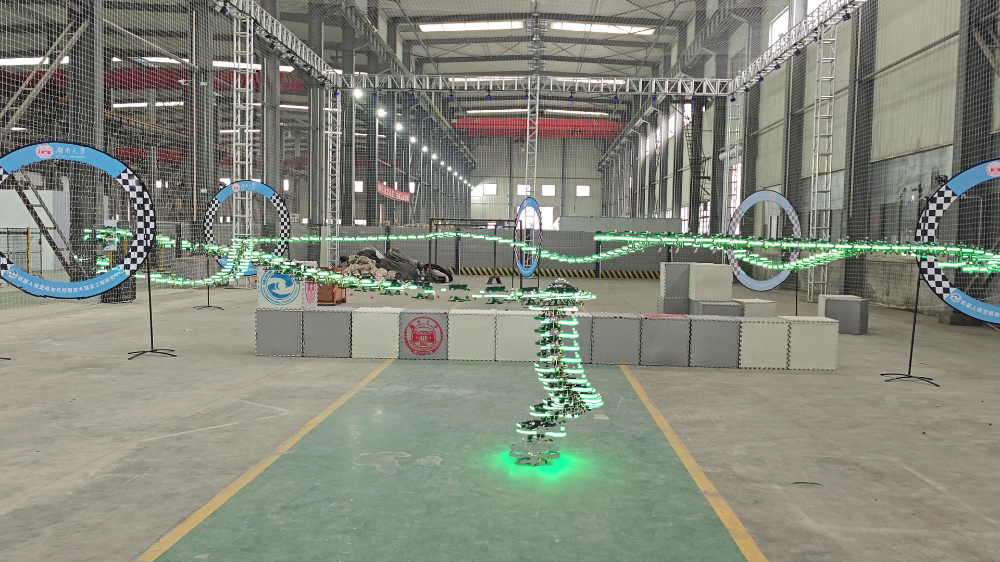

# A tool to visualize the trajectory of drones in videos

## If you have better ideas, welcome to propose them!! Please kindly star ⭐ this project if it helps you

Still shot videos:

And the result:

Although sometimes it can be wrong, this tool works well in certain circumstances. If you are looking for higher quality images, you may need to do it manually!

## Update

1. Added a UI interface for more intuitive display
2. Optimized the generation logic

    PS: the video is come from [composite_image](https://github.com/RENyunfan/composite_image)

    
3. Add more parameters and set gradient transparency overlay
    

## Parameter Description

### 采样间隔（sample_interval_entry）

作用：每隔多少帧进行一次处理（间隔越大，计算越快，但可能导致轨迹不连续）。
默认值：10（每10帧进行一次分析）。

### 差分阈值（diff_threshold_entry）

作用：用于二值化处理，设置像素差值的阈值（数值越低，检测的运动更灵敏）。
默认值：30（像素差大于30的部分视为运动）。

### 膨胀核大小（kernel_size_entry）

作用：对检测到的运动区域进行膨胀，以去除噪声（数值越大，运动区域轮廓越平滑）。
默认值：15（15×15的核进行膨胀）。

### 起始透明度（start_alpha_entry）

作用：决定运动区域最初的透明度（0.0 完全透明，1.0 不透明）。
默认值：0.2（运动区域初始时 20% 透明）。

### 最终透明度（end_alpha_entry）

作用：控制运动区域的最终透明度（在处理过程中逐渐增加）。
默认值：1.0（最终完全不透明）。

## Recommend

This [project](https://github.com/RENyunfan/composite_image) is also very good

## Disadvantages

### Manual parameter adjustment

Please manually select the appropriate parameters according to your own video

### Handling different speeds

If the speed of the drone changes in the video, the trajectory may not be good.

### The influence of background

If the background moves, such as lighting changes or pedestrian movement, the superposition may be incorrect.
