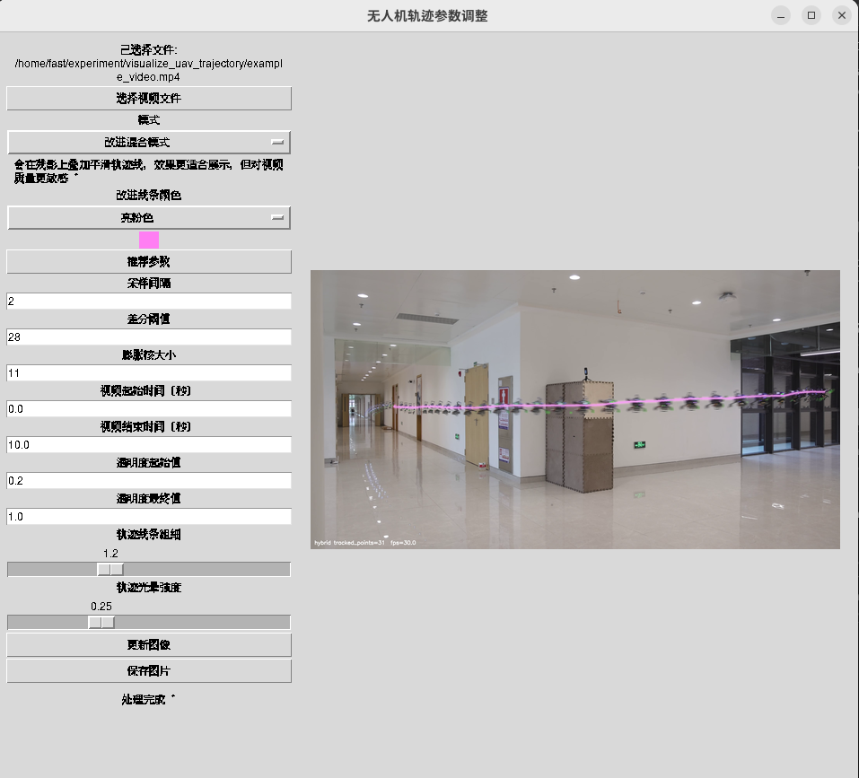
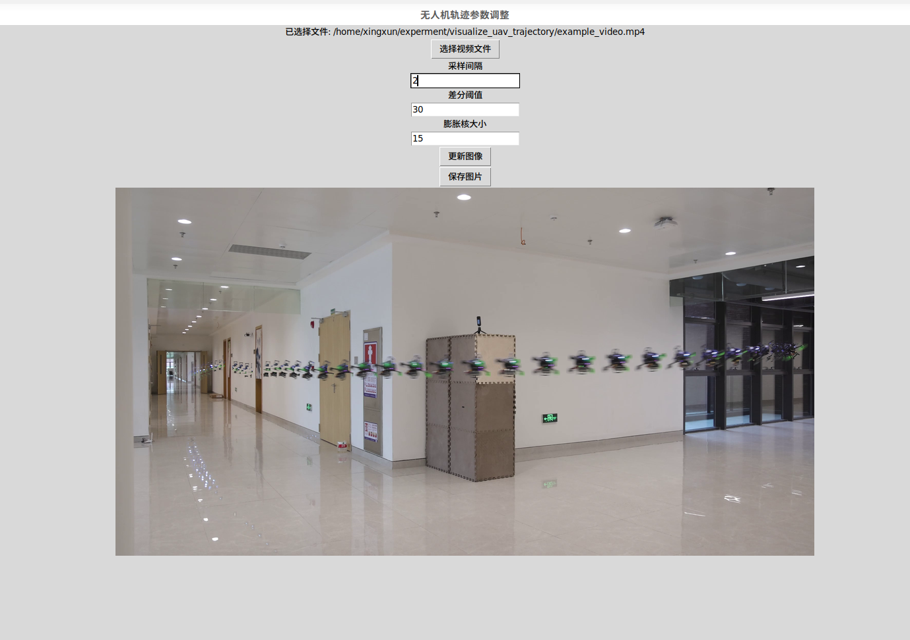
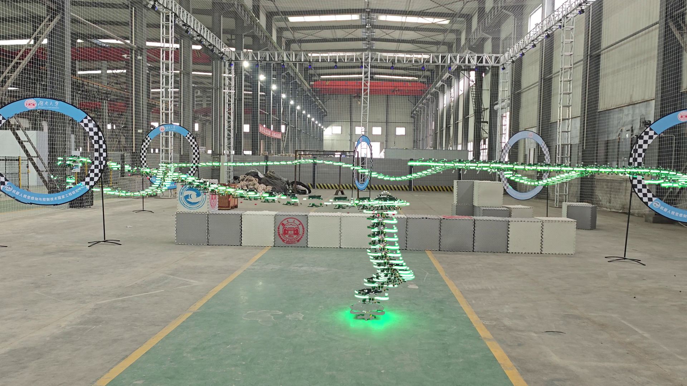
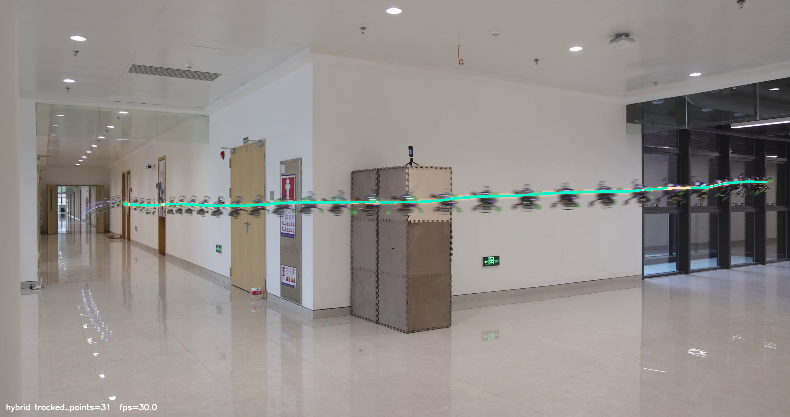

# A tool to visualize the trajectory of drones in videos

## If you have better ideas, welcome to propose them!! Please kindly star ⭐ this project if it helps you

## Modes

This project now keeps **both** implementations:

- `legacy`: the original motion-overlay method based on frame differencing against the first frame
- `improved`: an optional hybrid mode that keeps the original overlay effect and adds a smoothed tracked trajectory line on top

The original implementation still exists and is not replaced. The improved result is only a selectable mode.

## GUI Highlights

- GUI now supports explicit mode switching between `legacy` and `improved`
- improved mode exposes selectable line colors, line thickness, and glow strength
- GUI shows status and failure messages directly inside the window instead of relying on terminal output
- built-in recommended parameter presets are available for both modes



Still shot videos:


And the result:


Although sometimes it can be wrong, this tool works well in certain circumstances. If you are looking for higher quality images, you may need to do it manually!

## Update

1. Added a UI interface for more intuitive display
2. Optimized the generation logic


    PS: the video is come from [composite_image](https://github.com/RENyunfan/composite_image)

    
3. Add more parameters and set gradient transparency overlay
    
4. Added an optional improved visualization mode:
   - preserve the original `legacy` output
   - track the drone trajectory with a lightweight rule-based tracker
   - smooth the trajectory and draw a clean highlight line on top of the original overlay
   - support CLI export for `legacy`, `improved`, and comparison outputs

## Improved Example

Improved hybrid output:



Legacy vs improved comparison:


## Parameter Description

### 采样间隔（sample_interval_entry）

作用：每隔多少帧进行一次处理（间隔越大，计算越快，但可能导致轨迹不连续）。
默认值：10（每10帧进行一次分析）。

### 差分阈值（diff_threshold_entry）

作用：用于二值化处理，设置像素差值的阈值（数值越低，检测的运动更灵敏）。
默认值：30（像素差大于30的部分视为运动）。

### 膨胀核大小（kernel_size_entry）

作用：对检测到的运动区域进行膨胀，以去除噪声（数值越大，运动区域轮廓越平滑）。
默认值：15（15×15的核进行膨胀）。

### 起始透明度（start_alpha_entry）

作用：决定运动区域最初的透明度（0.0 完全透明，1.0 不透明）。
默认值：0.2（运动区域初始时 20% 透明）。

### 最终透明度（end_alpha_entry）

作用：控制运动区域的最终透明度（在处理过程中逐渐增加）。
默认值：1.0（最终完全不透明）。

## Recommend

This [project](https://github.com/RENyunfan/composite_image) is also very good

## Disadvantages

### Manual parameter adjustment

Please manually select the appropriate parameters according to your own video

### Handling different speeds

If the speed of the drone changes in the video, the trajectory may not be good.

### The influence of background

If the background moves, such as lighting changes or pedestrian movement, the superposition may be incorrect.

## CLI Usage

Export the original implementation (`legacy`):

```bash
python3 visualize_uav_trajectory.py \
  --video example_video.mp4 \
  --method legacy \
  --output images/example_legacy.png
```

Export the optional improved result:

```bash
python3 visualize_uav_trajectory.py \
  --video example_video.mp4 \
  --method improved \
  --output images/example_improved.png
```

Export a side-by-side comparison image:

```bash
python3 visualize_uav_trajectory.py \
  --video example_video.mp4 \
  --compare \
  --output images/example_comparison.png
```

If you omit `--video`, the script starts the Tkinter GUI. The original implementation remains available in code as the `legacy` mode, and the improved mode is an extra option for CLI export and further extension.

Note: the `images/` directory is ignored by git. For repository examples shown in this README, the exported result images are copied into `example/` before commit.

## Project Structure

The code is split to make future maintenance easier:

- `visualize_uav_trajectory.py`: thin entry point
- `uav_vis/config.py`: shared constants and style definitions
- `uav_vis/core.py`: legacy rendering, improved tracking, and image generation logic
- `uav_vis/gui.py`: Tkinter GUI and in-window status handling
- `uav_vis/cli.py`: CLI parser and command execution flow
